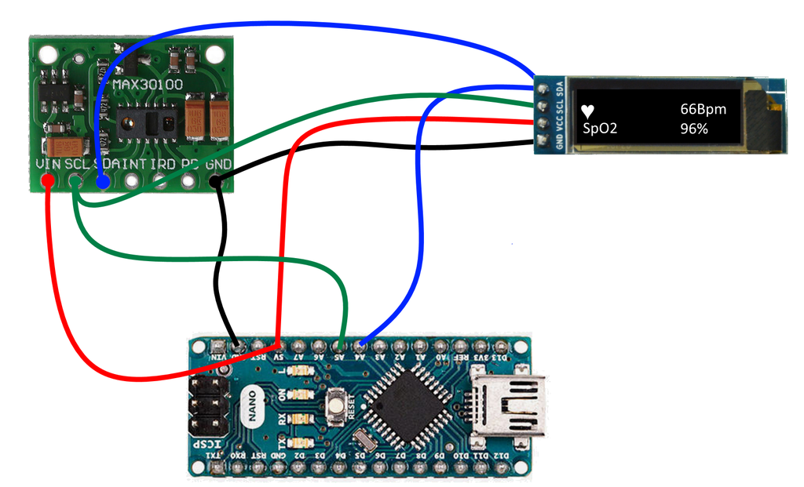

# Pulse-Oximeter With Arduino and MAX30100

## Description:

The aim of this project is to create an automatic pulse-oximeter device for monitoring the SpO2 blood saturation and the heart rate using the MAX30100 Arduino module.

The output of the measurement is shown in a white 0.96 128x64 OLED display.

The application runs on an Arduino Nano v3.0 Atmega 328 card.

## Dependencies:

This Arduino project depends on the following libraries:

* [Pulse oximeter driver](https://github.com/oxullo/Arduino-MAX30100)
* [Display driver](https://github.com/olikraus/u8g2)

## Connection diagram:

## Bill of materials:

* MAX30102 Pulse oximeter sensor (Costs approx. 5.34 U$D)
* Arduino NANO Atmega328 (Costs approx. 4.15 U$D)
* Display Oled 1.3 Blanco 128x64 I2c Delta Iot (Costs approx. 6.25 U$D)
* Various dupont jumper wires (Costs approx. 1 U$D)

Total cost: 16.74 U$D

## Troubleshooting

Some batches of the max sensor module made in China have an error in the design of the printed circuit board that can cause the measurement to be unstable because a defect in the voltage regulation part of the board.
That happened to me and I had to correct the board to work properly and it was very easy.
The error is not dangerous because it is very noticeable and the vast majority of the time the board directly can't keep powered on reliably, leaving only sometimes the possibility that it will turn on but that it measures unrealistic values ​​such as 30% saturation.
This error is fixable and after doing that I've never had a problem with the sensor module again. For more details on how to repair the sensor board refer to the [following web page](https://www.google.com/amp/s/reedpaper.wordpress.com/2018/08/22/pulse-oximeter-max30100-max30102-how-to-fix-wrong-board/amp/).

## TODO:

* Add a dependency manager file that will allow us to download the libraries automatically
* Construct a 3D printable cabinet and upload his design
* Include some photos of the device
* Include some IOT features like pushing data to wifi
* Improve connection diagram

## DISCLAIMER:

This device is currently a work in progress and its stability or accuracy is not the best as it does not have a cabinet that keeps your finger in place and firmly pressed to measure.
<b>Do not rely solely on this device</b> as a critical medical decision-making process.
